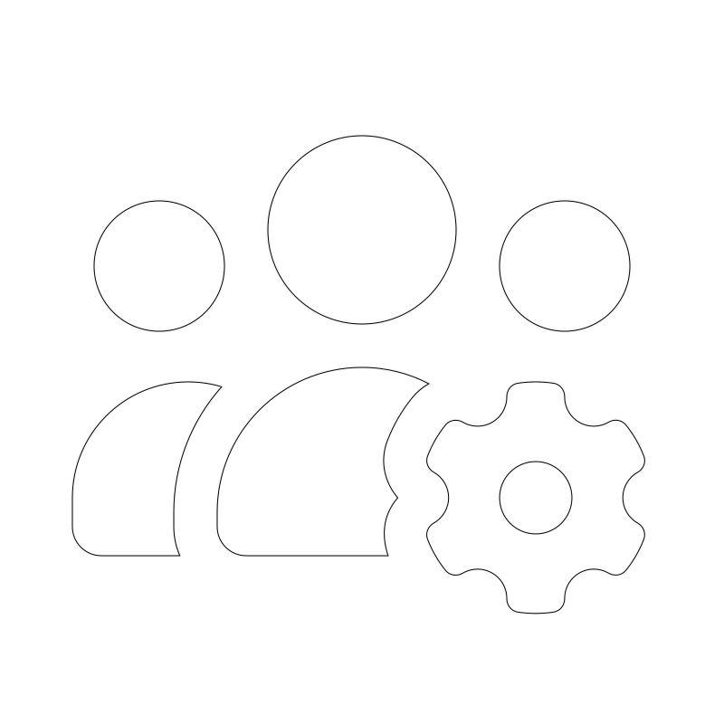

<div align="center">



# Roblox Account Manager

A portable desktop application to store, manage, and launch Roblox accounts from an encrypted, password-protected vault.

[](https://github.com/sleaze5/RobloxAccountManager/releases/latest) [](https://github.com/sleaze5/RobloxAccountManager/actions/workflows/check.yml) [](LICENSE)

[](https://github.com/sleaze5/RobloxAccountManager/releases/latest/download/RobloxAccountManager.exe) [](https://github.com/sleaze5/RobloxAccountManager/releases/latest/download/RobloxAccountManager-arm64.exe) [](https://github.com/sleaze5/RobloxAccountManager/releases/latest/download/RobloxAccountManager-linux-x64.tar.gz) [](https://github.com/sleaze5/RobloxAccountManager/releases/latest/download/RobloxAccountManager-macos-arm64.zip) [](https://github.com/sleaze5/RobloxAccountManager/releases/latest/download/RobloxAccountManager-macos-x64.zip)

[All releases](https://github.com/sleaze5/RobloxAccountManager/releases) | [Installation](#installation) | [Platform support](#platform-support) | [Building from source](#building-from-source)

</div>

This app is built primarily for Windows but also works on Linux and macOS. Some features may be unavailable on those platforms.

## Features

- **Encrypted vault:** SQLCipher encryption, protected by your master password through Argon2id.
    - Unlock automatically on your device.
    - Restore from automatic backups.
- **Account import:** Paste multiple `.ROBLOSECURITY` cookies, or sign in through a managed browser.
- **Account management:** Search, tag, favorite, and reorder accounts.
    - View profiles, Robux balances, online status, and account details.
    - Change Roblox privacy and account settings.
    - Read and send Roblox chats.
    - Renew cookies and open signed-in browsers.
- **Game launching:** Join by Place ID, Job ID, user, or Roblox link with one or more accounts.
    - Join private servers, share links, and experience invites.
    - Run multiple Roblox clients at once on Windows.
- **Games and servers:** Search games, save favorite places, and browse servers by ping and player count.
    - Find the nearest joinable server with [RoValra](https://www.rovalra.com).
- **Logs Explorer:** Browse Roblox logs by session and game visit, and rejoin past servers.
- **Portable storage:** Run without an installer, with the vault next to the executable or in your user data folder.

RoValra features are on by default. Turn them off in Settings > Integrations.

## Installation

Download for your system using the buttons above or the [latest release](https://github.com/sleaze5/RobloxAccountManager/releases/latest).

### Windows

1. Download `RobloxAccountManager.exe` for x64 or `RobloxAccountManager-arm64.exe` for ARM64.
2. Put the executable in its own folder. Portable storage creates `storage/` and `logs/` next to it.
3. Run the executable.
4. Choose portable or standard storage.
5. Create a master password.

### Linux

1. Download `RobloxAccountManager-linux-x64.tar.gz`.
2. Extract the archive into its own folder:

    ```sh
    tar -xzf RobloxAccountManager-linux-x64.tar.gz
    ```

3. Install Sober or Mocktail to join games.
4. Run `./RobloxAccountManager`.
5. Choose portable or standard storage.
6. Create a master password.

The application needs the GTK 4 and WebKitGTK 6 libraries. Automatic unlock needs a Secret Service provider, such as GNOME Keyring or KWallet. The managed browser needs the system libraries of Chrome and unprivileged user namespaces for the Chrome sandbox.

### macOS

1. Download `RobloxAccountManager-macos-arm64.zip` for Apple silicon or `RobloxAccountManager-macos-x64.zip` for Intel.
2. Extract the archive.
3. Open `RobloxAccountManager.app`. Gatekeeper blocks the first launch, because release bundles are signed ad hoc and are not notarized. Allow the application in System Settings > Privacy & Security, or open it from the Finder context menu.
4. Create a master password.

To join games, install Roblox. The application opens `Roblox.app` from `/Applications` or `~/Applications`.

> [!IMPORTANT]\
> Before each launch on macOS, the application deletes the cookie file of the Roblox Player. Otherwise, Roblox joins with the account that last signed in to the Roblox app. As a result, every launch signs the Roblox app out.

## Platform support

Windows is the primary platform. The minimum supported versions are:

- Windows 10 or later: x64 and ARM64
- Linux x64 with glibc 2.38 or later
- macOS 12 or later: Apple silicon and Intel

Feature differences:

- **Windows:** Every feature is available, including multi-instance, Roblox process control, and direct launch of `RobloxPlayerBeta.exe`. Automatic unlock uses DPAPI. On ARM64, the managed browser runs x64 Chrome through Windows 11 emulation, because Chrome for Testing has no ARM64 build for Windows.
- **Linux:** Joins games through Sober or Mocktail. Settings > Roblox chooses the client. Its Automatic option uses the installed client, or the desktop default when both are installed. Automatic unlock uses the Secret Service. Multi-instance and Roblox process control are unavailable.
- **macOS:** Only standard storage is available, because a portable vault would sit inside the app bundle. Automatic unlock uses the login Keychain. Roblox process control is available. Multi-instance is unavailable.

## Data and privacy

All application data stays in one folder:

```text
storage/
    settings.json
    vault/       # Encrypted vault, key file, and automatic unlock key
    backups/     # Vault backups
    runtime/     # Managed browser
    temp/        # Temporary browser data
logs/
```

- Portable storage uses the executable's folder. Standard storage uses your OS user's application data folder. Settings > About shows the storage mode and data folder.
- Keep the data folder on a local or removable drive. The application rejects network folders. Cloud-synchronized folders are unsupported, because another process can replace the vault files.
- `vault.db` and `vault.key` work on every supported operating system. `autounlock.key` works only on the device and operating system user that created it. After a move to another device, unlock the vault with the master password and turn on automatic unlock again.
- The application connects to Roblox, to the RoValra API when the integration is on, to GitHub to check for updates, and to Google storage to download the managed browser. Requests to the RoValra API include only Place IDs and server IDs.
- Application logs never contain cookies, passwords, or other credentials.

## Building from source

### Requirements

- [Go](https://go.dev) 1.26 or later
- [Bun](https://bun.sh) 1.3.11 or later
- [Task](https://taskfile.dev) 3
- A C compiler for cgo, because SQLCipher needs cgo:
    - **Windows x64:** MinGW-w64 GCC on `PATH`.
    - **Windows ARM64:** MinGW-w64 GCC and `aarch64-w64-mingw32-clang` from [llvm-mingw](https://github.com/mstorsjo/llvm-mingw) on `PATH`. Put llvm-mingw after the x64 MinGW on `PATH`, because llvm-mingw also ships a `gcc`.
    - **Linux:** A C compiler and the GTK 4 and WebKitGTK 6 development libraries. On Ubuntu 24.04, install `libgtk-4-dev` and `libwebkitgtk-6.0-dev`.
    - **macOS:** Xcode command line tools. On macOS, the Wails runtime also uses cgo.

### Build

Clone the repository:

```sh
git clone https://github.com/sleaze5/RobloxAccountManager.git
cd RobloxAccountManager
```

Run the build task for your target:

- `task build:windows-amd64`: Windows x64. Runs on Windows.
- `task build:windows-arm64`: Windows ARM64. Cross-compiles on x64 Windows with llvm-mingw.
- `task build:linux-amd64`: Linux x64. Runs on Linux.
- `task build:darwin-arm64`: macOS app bundle for Apple silicon. Runs on macOS.
- `task build:darwin-amd64`: macOS app bundle for Intel. Runs on macOS.

Each build first runs `task fix` to format, apply lint fixes, and validate the source. Output goes to `dist/<os>-<arch>/`.

Other tasks:

- `task dev`: Start development mode with hot reload.
- `task check`: Validate the source without changing files.
- `task --list --sort none`: List every task.

> [!WARNING]\
> `task clean` deletes builds, dependencies, generated files, logs, and all portable data, including any account vault in `dist/`. This cannot be undone. The task asks for confirmation, and `-y` skips it.

## License

Roblox Account Manager is released under the [MIT License](LICENSE).

Copyright (c) 2026 sleaze

The application includes third-party works that keep their own licenses. See [THIRD_PARTY_NOTICES.md](THIRD_PARTY_NOTICES.md) and [THIRD_PARTY_LICENSES.txt](THIRD_PARTY_LICENSES.txt).

## Disclaimer

Roblox Account Manager is an unofficial, independent project. It is not affiliated with, endorsed by, or sponsored by Roblox Corporation. Roblox is a trademark of Roblox Corporation.

- You are responsible for your use of this software and for following the [Roblox Terms of Use](https://en.help.roblox.com/hc/en-us/articles/115004647846-Roblox-Terms-of-Use).
- A `.ROBLOSECURITY` cookie gives full access to its account. Never share cookies, vault files, or copied launch commands.
- The software is provided "as is", without warranty of any kind. See the [MIT License](LICENSE).
